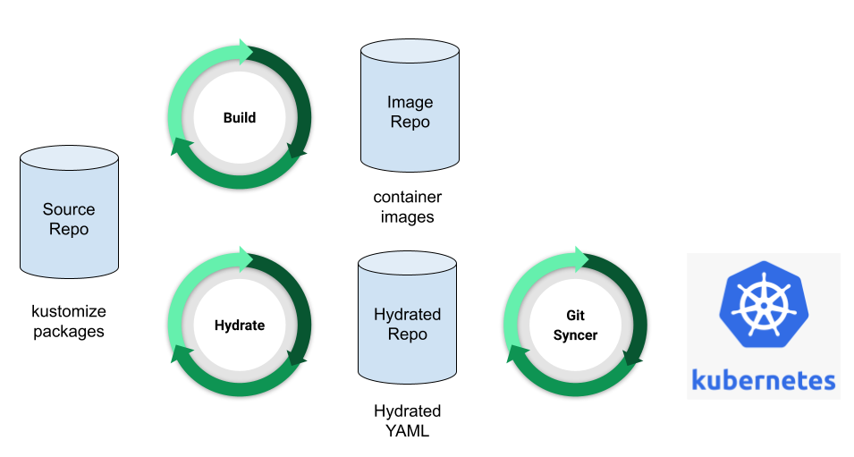

# How Hydros Works

The diagram below illustrates how Hydros fits into the GitOps workflow.



The primary problem that Hydros solves is hydrating configuration packages to produce fully specified Kubernetes YAML
that can be applied to the cluster. This YAML is checked into a git repository (the hydrated repo above) from
which it can be continuously applied to the cluster using a GitOps tool like [flux](https://fluxcd.io/) or
[ArgoCD](https://argoproj.github.io/argo-cd/).

Here's how this works

1. Hydros continuously monitors the source repository and makes sure the hydrated repository and
   source repository are in sync
2. The source repository and hydrated repository are in sync when the rendered YAML in the hydrated
   repository was generated from the latest commit to the source repository
3. When the source repository is not in sync with the hydrated repository, Hydros performs the following steps
    * It identifies the container images required by each Kustomize package in the source repository
    * It ensures there exists a corresponding container image built from the source commit
    * It substitutes the container image references in the Kustomize packages to pin the images to the
      corresponding container image built from the source commit
    * It runs `kustomize build` to generate the rendered YAML
    * It opens a PR in the hydrated repo with the rendered YAML

## Configuring Hydros - ManifestSync

Hydros is configured using a [ManifestSync](api/v1alpha1/gitops.go) resource. Here's an example

```yaml
apiVersion: mlp.primer.ai/v1alpha1
kind: ManifestSync
metadata:
  name: hydros-dev-takeover
spec:
  sourceRepo:
    org: jlewi
    repo: hydros
    branch: main
  forkRepo:
    org: jlewi
    repo: hydrated
    branch: hydros/hydros-takeover
  destRepo:
    org: jlewi
    repo: hydrated
    branch: main
  sourcePath: /manifests
  selector:
    matchLabels:
      app: hydros
      environment: lewi
  destPath: hydros
```

A ManifestSync defines a collection of one or more Kustomize packages that should be hydrated and checked in
atomically. The collection of Kustomize packages is defined by the [selector](https://kubernetes.io/docs/concepts/overview/working-with-objects/labels/).
The selector is used to match Kustomize packages that should be included in that Manifest. The selector is applied
to labels on the kustomization resource defined in one or more `kustomization.yaml` files located beneath the
ManifestSync. For example the labels above would match the following `kustomization.yaml`

```yaml
apiVersion: kustomize.config.k8s.io/v1beta1
kind: Kustomization
metadata:
  labels:
    app: hydros
    environment: lewi
```

Using labels and selectors allows a ManifestSync to select a particular set of
[kustomize overlays](https://kubernetes.io/docs/tasks/manage-kubernetes-objects/kustomization/#bases-and-overlays).

The ManifestSync contains 3 [GitHubRepo](api/v1alpha1/gitops.go) specs each of these contains the following three fields

* **org** - The GitHub organization that owns the repository
* **repo** - The name of the repository
* **branch** - A branch on the repository

The repositories perform the following functions

* **sourceRepo** - This is the repository & branch that contains the source code for the Kustomize packages. This is the
  repository that will be monitored for changes.
* **forkRepo** - This is the repository & branch that will be used to open the PR. Hydros will push the hydrated
  manifests to this repository and then open a PR from it into the branch specified by `destRepo`
* **destRepo** - This is the repository & branch for the hydrated manifests. This is the repository that will be
  continuously applied to the cluster.

The other key fields in the ManifestSync are explained below

* **sourcePath** - This is the path in the source repository where the Kustomize packages are located
    * Leave this blank or set it to "/" to search the entire repository

* **destPath** - This is the path in the hydrated repository where the hydrated manifests should be checked in
    * **Important** each ManifestSync must have a unique destPath and these **should not be subdirectories of one another**
    * **Hydros deletes all files in destPath before checking in the hydrated manifests**
        * This ensures any deleted resources get removed from the hydrated repository and end up getting pruned
          by ArgoCD/Flux.
